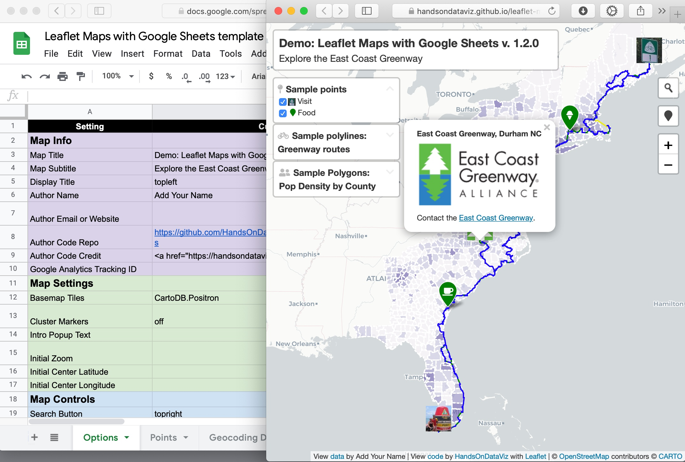

# Leaflet Maps with Google Sheets
Customize Leaflet maps with a linked Google Sheets template or CSV files and GeoJSON data on GitHub

## Live links (replace with your own)
- Leaflet Map https://handsondataviz.github.io/leaflet-maps-with-google-sheets/
- Google Sheets template https://docs.google.com/spreadsheets/d/1ZxvU8eGyuN9M8GxTU9acKVJv70iC3px_m3EVFsOHN9g/edit#gid=0

## Create your own
See step-by-step tutorial in *Hands-On Data Visualization* https://handsondataviz.org/leaflet-maps-with-google-sheets.html

#### Geocode your address data with Google Sheets add-on
To geocode (find latitude and longitude coordinates), we recommend installing the free [Geocoding by SmartMonkey add-on for Google Sheets](https://gsuite.google.com/marketplace/app/geocoding_by_smartmonkey/1033231575312). Insert your addresses in place of the samples in the Geocoding Details tab, then use Add-Ons > Geocoding > Geocode Details menu. Learn more in *Hands-On Data Visualization* https://handsondataviz.org/geocode.html

#### To finalize your map, you need to either:
- Download each Google Sheets tab as a CSV file and upload into a `csv` subfolder in your GitHub repo
  - OR
- Get your own Google Sheets API Key to insert into `google-doc-url.js`

See Steps G or H in the tutorial https://handsondataviz.org/leaflet-maps-with-google-sheets.html

## Update your code for any pre-October 2020 maps before January 2021
If you used our code to create a map prior to October 2020, you will need to update your version before January 26, 2021 for it to continue to work. Google announced that it will [migrate from Google Sheets API v3 to v4 in Jan 2021](https://developers.google.com/sheets/api/v3), and we updated our code to v1.2 on September 29th to address Google's changes.

Four options to update your code:

Option A: Use your existing code and pull your data from CSV files rather than a linked Google Sheet. This avoids the need for a Google Sheets API key, but does not take advantage of our other code updates.

1. Go to your linked Google Sheet, and for each tab, *File > Download* in CSV format, and rename them this way: Options.csv, Points.csv, etc.
2. Log into the web interface of your GitHub map repo.
3. Create a new subfolder named `csv` in your GitHub repo, by selecting *Add file > Create a file* and typing in `csv/`. The forward slash indicates it is a folder, not a file.
4. In your GitHub repo, upload each CSV file you created into this new `csv` subfolder.
5. In your Github repo, open the `google-doc-url.js` file, scroll to the bottom of the page, and delete it.
Now the code automatically searches for data in your CSV folder, rather than your Google Sheet. If desired, you can continue to use the Google Sheet to edit your map content and upload those changes to the CSV folder each time, or edit the CSV files directly.

OR 

Option B: If you understand (or are willing to learn about) [GitHub Desktop](https://handsondataviz.org/github-desktop-atom.html), use it to move copies of the newer code (index.html, scripts folder, style.css, etc.) into your repo via your local computer. In the `google-doc-url.js` file, copy and paste the Google Sheets API key that appears in the lower half of our code, but keep your own Google Sheets ID that appears in the upper-half of your code.

OR

Option C: If you originally "forked" a copy of our code, create a GitHub "pull request" to update your repo with our code revisions, including the Google Sheets API key. We recommend this option only if you understand (or are willing to learn about) GitHub pull requests, and can deal with resolving conflicts between your code and our updated code.
Warning: Since this operation might overwrite some of your code, go to *Code > Download ZIP* to make a backup to your local computer.
1. Log into the web interface of your GitHub storymap repository.
2. Click *Pull requests* and click the green button for a *New pull request*.
3. On the *Comparing Changes* page, use the menus to pull code *into* your repo *from* the original repo, named HandsOnDataViz/leaflet-maps-with-google-sheets. GitHub may warn that you cannot automatically merge the files, but proceed anyways.
4. You may need to click the *Resolve conflicts* button on the next screen, which means you need to sort out which portions of your code to keep and which portions of our code to accept. Generally speaking, you should accept our updates for index.html, style.css, and most scripts.js, while keeping your own content for README.md, media, and geojson folder content. In the google-doc-url.js file, you should keep your own Google Sheet ID, but temporarily add our Google Sheets API key until you create your own. In GitHub, you can resolve code conflicts by deleting/keeping lines in specific files.

OR

Option D: Start over with a brand-new repo, and migrate your existing map content. Make a copy of our newer code by clicking the green 'Use template' button. Migrate any media folder or geodata folder content from your old repo to your new repo, by downloading to your local computer and uploading to GitHub. Reconnect your Google Sheet ID to the `google-doc-url.js` file in your new repo.

## Credits (and licenses)
Developed by [Ilya Ilyankou](https://github.com/ilyankou) and [Jack Dougherty](https://github.com/jackdougherty) with support from Trinity College CT. Inspired by Code for Atlanta mapsfor.us (2016) https://github.com/codeforatlanta/mapsforus (BSD-3-Clause)

We use [Google Sheets API version 4](https://developers.google.com/sheets/api), with these open-source components:

- Leaflet v1.7.1 https://leafletjs.com (BSD-2-Clause)
- jQuery v3.5.1 https://code.jquery.com (MIT)
- PapaParse v5.3.0 to parse CSV with JavaScript (MIT)
- Font Awesome (v4.7) https://cdn.fontawesome.com (MIT, SIL OFL 1.1)
- leaflet-providers (v1.10.2) https://github.com/leaflet-extras/leaflet-providers (BSD-2-Clause)
- Leaflet.awesome-markers (v2.0.4), manually updated to svg to allow hex and material icons https://github.com/sigma-geosistemas/Leaflet.awesome-markers (MIT)
- Leaflet.markercluster (v1.4.1) https://github.com/Leaflet/Leaflet.markercluster (MIT)
- Leaflet.MarkerCluster.LayerSupport (v.2.0.1) https://github.com/ghybs/Leaflet.MarkerCluster.LayerSupport (MIT)
- Leaflet Control Geocoder v1.13.0 https://github.com/perliedman/leaflet-control-geocoder (BSD 2-Clause)
- leaflet-locatecontrol (v0.72.0) https://github.com/domoritz/leaflet-locatecontrol (MIT)
- jQuery-CSV (v1.0.11) https://github.com/evanplaice/jquery-csv (MIT)
- DataTables (v1.10.22) by SpryMedia Ltd. https://datatables.net (MIT)
- Material icons https://material.io/resources/icons/ (Apache)
- Single Element CSS Spinner (31 May 2016) https://github.com/lukehaas/css-loaders (MIT)
- Google Colour Palette Generator (2015) https://github.com/google/palette.js (MIT)
- polylabel (Dec. 2016 customized) https://github.com/mapbox/polylabel to optimally place text labels in a polygon (ISC), with TinyQueue (v1.1.0) (https://github.com/mourner/tinyqueue), polylabel's dependency (ISC)
